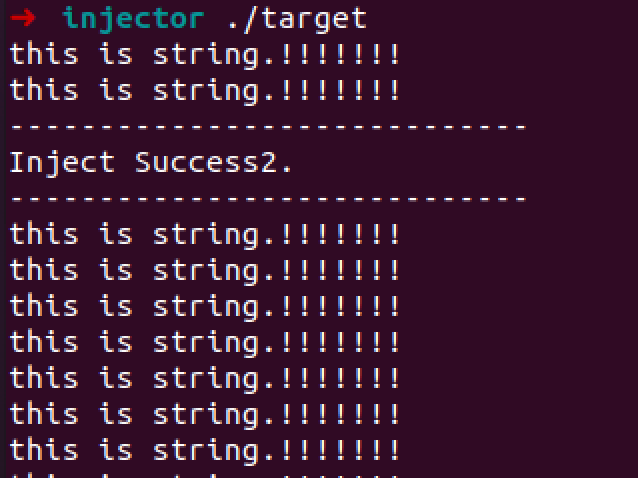

简单地实现了ptrace注入。

为啥做这个？最近的实习在做安卓app测试，其中有个测试项是要检测app是否具有防御ptrace注入的能力。公司提供的注入器是坏的。。。(运行会提示segmentation fault)。本来自己写一个，网上资料也蛮多的，但是被项目经理叫停了——这太浪费时间，注入器不行，就当这app是安全的吧。而且再一想，我也没安卓的编译环境，好像要啥ndk，懒得弄，干脆就实现一个x64架构的吧。

在target进程中链接进了`libdl.so`，也就是`dlopen()`等函数所在的库。

* injector.c：注入器
  `gcc injector.c -o injector -ldl -g`
* target.c：待注入的进程
  `gcc target.c -o target -ldl -g`
* libpayload.c：待注入的链接库
  `gcc libpayload.c -o libpayload.so -share -fPIC -g`

`sudo ./injector \`pidof target\` /home/coffee/Desktop/injector/libpayload InjectedSuccess2`

需要sudo。libpayload要写绝对路径(不太懂为啥)。




## ptrace 注入流程

远程进程——被注入的进程


* struct user_regs_struct。这个结构体，对于不同的架构来说，不一样。
    ```c
    #include<sys/user.h>
    struct user_regs_struct
    {
     __extension__ unsigned long long int r15;
     __extension__ unsigned long long int r14;
     __extension__ unsigned long long int r13;
     __extension__ unsigned long long int r12;
     __extension__ unsigned long long int rbp;
     __extension__ unsigned long long int rbx;
     __extension__ unsigned long long int r11;
     __extension__ unsigned long long int r10;
     __extension__ unsigned long long int r9;
     __extension__ unsigned long long int r8;
     __extension__ unsigned long long int rax;
     __extension__ unsigned long long int rcx;
     __extension__ unsigned long long int rdx;
     __extension__ unsigned long long int rsi;
     __extension__ unsigned long long int rdi;
     __extension__ unsigned long long int orig_rax;
     __extension__ unsigned long long int rip;
     __extension__ unsigned long long int cs;
     __extension__ unsigned long long int eflags;
     __extension__ unsigned long long int rsp;
     __extension__ unsigned long long int ss;
     __extension__ unsigned long long int fs_base;
     __extension__ unsigned long long int gs_base;
     __extension__ unsigned long long int ds;
     __extension__ unsigned long long int es;
     __extension__ unsigned long long int fs;
     __extension__ unsigned long long int gs;
    };
    
    ```
* ptrace_attach
    PTRACE_ATTACH
* ptrace_detach
    PTRACE_DETACH
* ptrace_continue
    PTRACE_CONT
* ptrace_getregs
    PTRACE_GETREGS
* ptrace_setregs
    PTRACE_SETREGS
* ptrace_writedata
    使用ptrace的PTRACE_POKETEXT、PTRACE_POKEDATA
* ptrace_readdata
    使用ptrace的PTRACE_PEEKTEXT、PTRACE_PEEKDATA
* ptrace_getretval
    函数参数传入一个user_regs_struct结构体。根据架构，获得函数的返回值，对于x64就是rax。
* ptrace_call
    函数参数传入要执行的函数地址`ExecAddr`、进入ptrace_call函数之前寄存器状态的`user_regs_struct`结构体`Regs`、函数的参数`Parameter`、函数参数的个数`ParameterNum`。
    根据函数参数的个数和架构(以下对于x64架构)，选择合适的参数传递方式。前6个参数传递给寄存器，后面的参数从右到左依次入栈。前者直接给寄存器赋值，后者入栈用`ptrace_writedata`函数，并让rsp减对应的值。随后，将0作为返回地址push到栈中(或者任意的非法的内存)，rsp需要减对应的值。将设置好的新`user_regs_struct`作为参数，通过`ptrace_setregs`设置远程进程的寄存器，用`ptrace_continue`让远程进程跑起来。由于前面设置了返回地址为0(非法的内存)，远程进程运行完`ExecAddr`后，将会发出SIGSEGV信号。我们通过waitpid捕捉SIGSEGV信号，当程序的状态为0xb7f时，说明捕捉到了。其中，0xb代表SIGSEGV，0x7f代表子进程为暂停状态。随后，我们再获取程序的寄存器状态到`Regs`中。
    

上面是一些要提前准备好的函数。
下面是利用注入动态链接库的大概流程。

1. attach远程进程
2. 获取远程进程的pid
3. 保存远程进程的上下文环境
4. 获取远程进程的`mmap()`函数地址
5. 使用`ptrace_call`调用`mmap()`，获得返回值
6. 向远程进程的内存中写入要注入的动态链接库的地址和要调用的函数名。
7. 获取远程进程的`dlopen()`、`dlsym()`、`dlclose()`等函数的地址
8. 使用`ptrace_call`调用`dlopen()`，打开要注入的动态链接库
9. 使用`ptrace_call`调用`dlsym()`，获得要调用函数的地址
10. 使用`ptrace_call`调用要调用的函数。
11. 恢复环境。
12. detach
  
    